# Visualizing Causal Graphs with caugi

``` r
library(caugi)
```

The `caugi` package provides a flexible plotting system built on grid
graphics for visualizing causal graphs. This vignette demonstrates how
to create plots with different layout algorithms and customize their
appearance.

## Basic Plotting

The simplest way to visualize a `caugi` graph is with the
[`plot()`](https://caugi.org/reference/plot.md) function:

``` r
# Create a simple DAG
cg <- caugi(
  A %-->% B + C,
  B %-->% D,
  C %-->% D,
  class = "DAG"
)

# Plot with default settings
plot(cg)
```

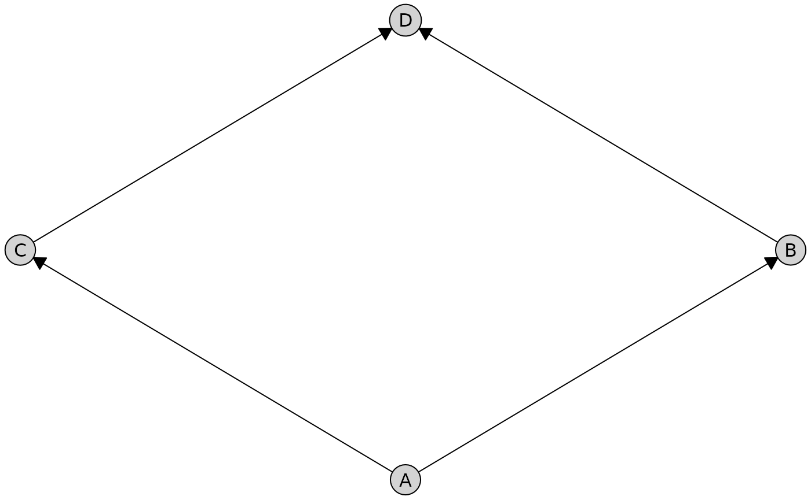

By default, [`plot()`](https://caugi.org/reference/plot.md)
automatically selects the best layout algorithm based on your graph
type. For graphs with only directed edges, it uses the Sugiyama
hierarchical layout. For graphs with other edge types, it uses the
Fruchterman-Reingold force-directed layout.

## Layout Algorithms

The `caugi` package provides four layout algorithms, each optimized for
different use cases.

### Sugiyama (Hierarchical Layout)

The Sugiyama layout (Sugiyama, Tagawa, and Toda 1981) is ideal for
directed acyclic graphs (DAGs). It arranges nodes in layers to emphasize
hierarchical structure and causal flow from top to bottom, minimizing
edge crossings.

``` r
# Create a more complex DAG
dag <- caugi(
  X1 %-->% M1 + M2,
  X2 %-->% M2 + M3,
  M1 %-->% Y,
  M2 %-->% Y,
  M3 %-->% Y,
  class = "DAG"
)

# Use Sugiyama layout explicitly
plot(dag, layout = "sugiyama")
```

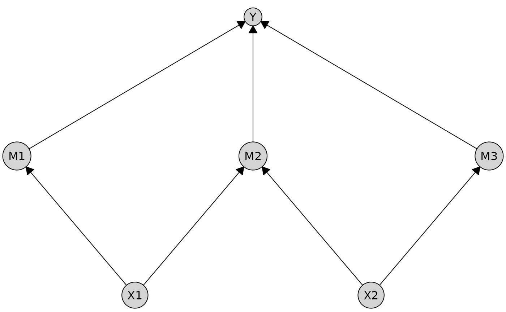

**Best for:** DAGs, causal models, hierarchical structures

**Limitations:** Only works with directed edges

### Fruchterman-Reingold (Spring-Electrical)

The Fruchterman-Reingold layout (Fruchterman and Reingold 1991) uses a
physical simulation where edges act as springs and nodes repel each
other like charged particles. It produces organic, symmetric layouts
with relatively uniform edge lengths.

``` r
# Create a graph with bidirected edges (ADMG)
admg <- caugi(
  A %-->% C,
  B %-->% C,
  A %<->% B, # Bidirected edge (latent confounder)
  class = "ADMG"
)

# Fruchterman-Reingold handles all edge types
plot(admg, layout = "fruchterman-reingold")
```

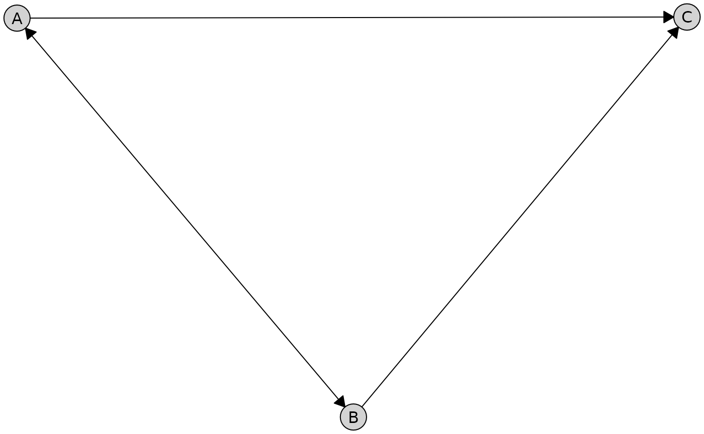

**Best for:** General-purpose visualization, graphs with mixed edge
types

**Advantages:** Fast, works with all edge types, produces balanced
layouts

### Kamada-Kawai (Stress Minimization)

The Kamada-Kawai layout (Kamada and Kawai 1989) minimizes “stress” by
making Euclidean distances in the plot proportional to graph-theoretic
distances. This produces high-quality layouts that better preserve the
global structure compared to Fruchterman-Reingold.

``` r
# Create an undirected graph
ug <- caugi(
  A %---% B,
  B %---% C + D,
  C %---% D,
  class = "UG"
)

# Kamada-Kawai for publication-quality visualization
plot(ug, layout = "kamada-kawai")
```

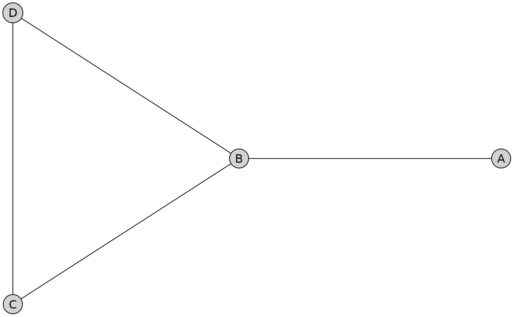

**Best for:** Publication-quality figures, when accurate distance
representation matters

**Advantages:** Better global structure preservation

### Bipartite Layout

The bipartite layout is designed for graphs with a clear two-group
structure, such as treatment/outcome or exposure/response relationships.
It arranges nodes in two parallel lines (rows or columns).

``` r
# Create a bipartite graph: treatments -> outcomes
bipartite_graph <- caugi(
  Treatment_A %-->% Outcome_1 + Outcome_2 + Outcome_3,
  Treatment_B %-->% Outcome_1 + Outcome_2,
  Treatment_C %-->% Outcome_2 + Outcome_3,
  class = "DAG"
)

# Horizontal rows (treatments on top, outcomes on bottom)
plot(
  bipartite_graph,
  layout = "bipartite",
  orientation = "rows"
)
```

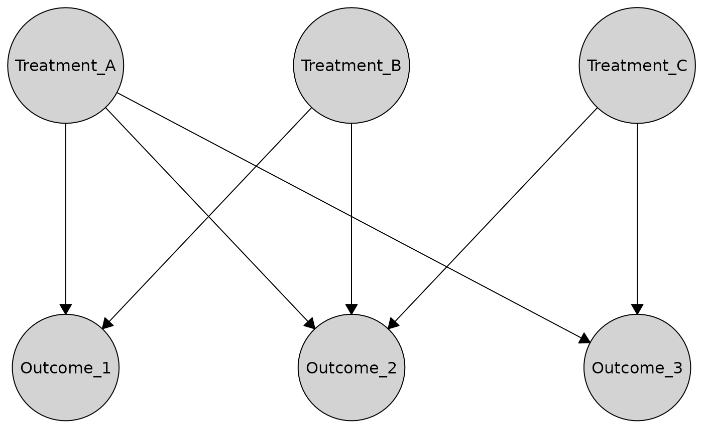

``` r

# Vertical columns (treatments on right, outcomes on left)
plot(
  bipartite_graph,
  layout = "bipartite",
  orientation = "columns"
)
```

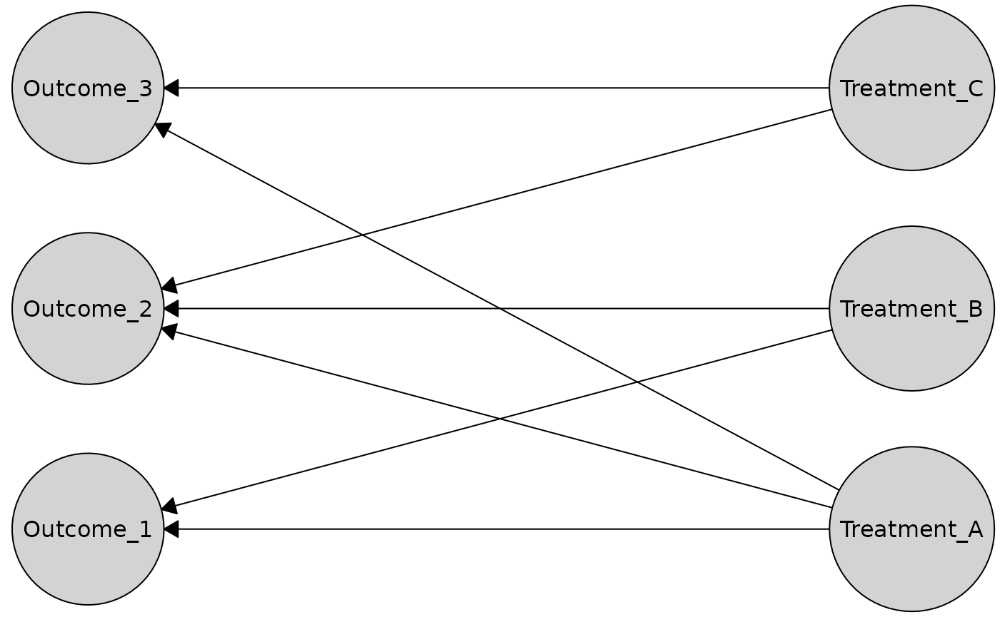

The bipartite layout automatically detects which nodes should be in
which partition based on incoming edges. Nodes with no incoming edges
are placed in one group, while nodes with incoming edges are placed in
the other. You can also specify the partition explicitly:

``` r
# Create bipartite layout with explicit partition
partition <- c(TRUE, TRUE, TRUE, FALSE, FALSE, FALSE)
plot(
  bipartite_graph,
  layout = caugi_layout_bipartite,
  partition = partition,
  orientation = "rows"
)
```

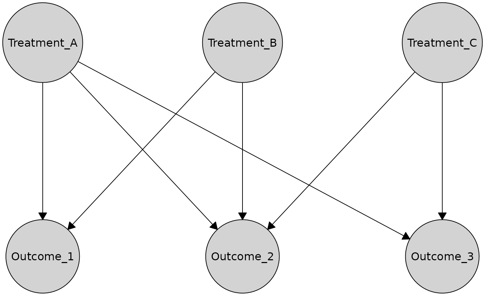

**Best for:** Treatment-outcome structures, exposure-response models,
bipartite causal relationships

**Advantages:** Clear visual separation, emphasizes directed
relationships between groups

### Comparing Layouts

You can compute and examine layout coordinates directly using
[`caugi_layout()`](https://caugi.org/reference/caugi_layout.md):

``` r
# Compute layouts
layout_sug <- caugi_layout(dag, method = "sugiyama")
layout_fr <- caugi_layout(dag, method = "fruchterman-reingold")
layout_kk <- caugi_layout(dag, method = "kamada-kawai")

# Examine coordinates
head(layout_sug)
#>   name    x   y
#> 1   X1 0.25 0.0
#> 2   X2 0.75 0.0
#> 3   M1 0.00 0.5
#> 4   M2 0.50 0.5
#> 5   M3 1.00 0.5
#> 6    Y 0.50 1.0
```

## Customizing Plots

The [`plot()`](https://caugi.org/reference/plot.md) function provides
extensive customization options for nodes, edges, and labels.

### Node Styling

Customize node appearance with the `node_style` parameter:

``` r
# Customize node colors and sizes
plot(
  cg,
  node_style = list(
    fill = "lightblue", # Fill color
    col = "darkblue", # Border color
    lwd = 2, # Border width
    padding = 4, # Text padding (mm)
    size = 1.2 # Size multiplier
  )
)
```

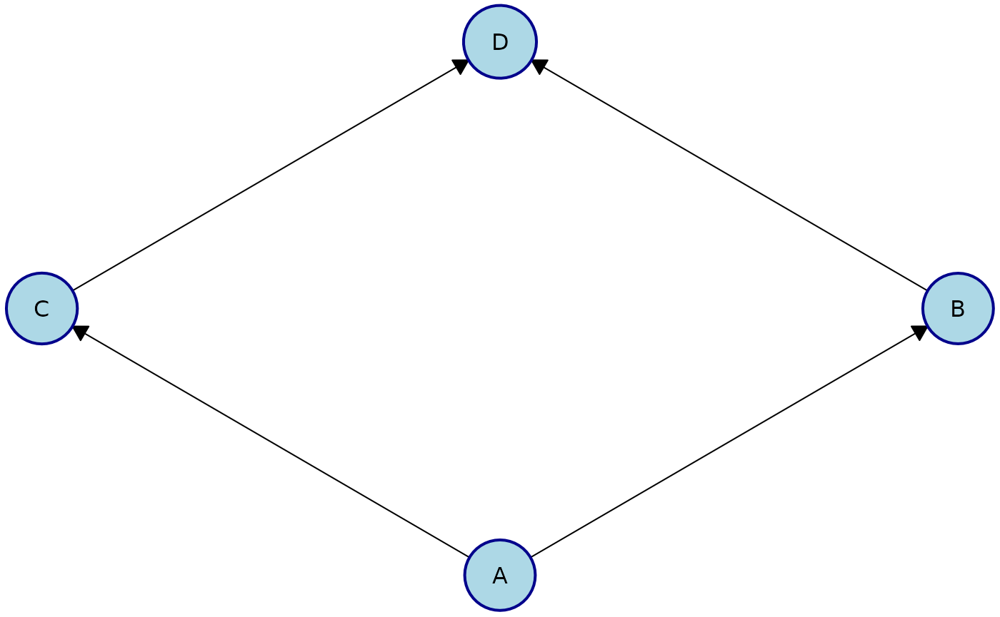

Available node style parameters:

- **Appearance (passed to
  [`gpar()`](https://rdrr.io/r/grid/gpar.html))**: `fill`, `col`, `lwd`,
  `lty`, `alpha`
- **Geometry**: `padding` (text padding in mm), `size` (node size
  multiplier)

### Edge Styling

Customize edge appearance with the `edge_style` parameter. You can set
global options or customize each edge type separately:

``` r
# Global edge styling
plot(
  dag,
  edge_style = list(
    col = "darkgray", # Edge color
    lwd = 1.5, # Edge width
    arrow_size = 4 # Arrow size (mm)
  )
)
```

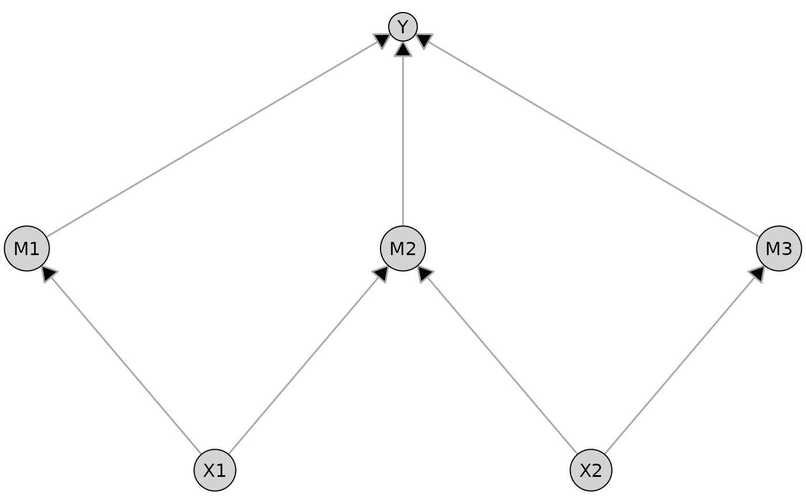

``` r
# Per-type edge styling for ADMG
plot(
  admg,
  layout = "fruchterman-reingold",
  edge_style = list(
    directed = list(col = "blue", lwd = 2),
    bidirected = list(col = "red", lwd = 2, lty = "dashed")
  )
)
```

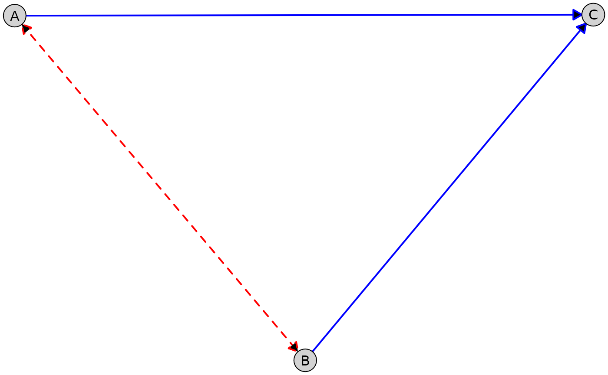

Available edge style parameters:

- **Appearance (passed to
  [`gpar()`](https://rdrr.io/r/grid/gpar.html))**: `col`, `lwd`, `lty`,
  `alpha`, `fill`
- **Geometry**: `arrow_size` (arrow length in mm)
- **Per-type options**: `directed`, `undirected`, `bidirected`,
  `partial`

### Label Styling

Customize node labels with the `label_style` parameter:

``` r
# Customize label appearance
plot(
  cg,
  label_style = list(
    col = "white", # Text color
    fontsize = 12, # Font size
    fontface = "bold", # Font face
    fontfamily = "sans" # Font family
  ),
  node_style = list(
    fill = "navy" # Dark background for white text
  )
)
```

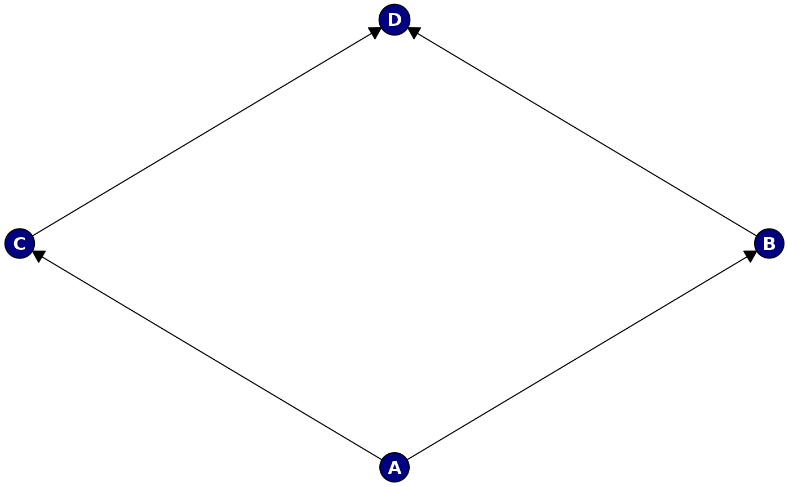

Available label style parameters (passed to
[`gpar()`](https://rdrr.io/r/grid/gpar.html)):

- `col`, `fontsize`, `fontface`, `fontfamily`, `cex`

### Combining Customizations

Put it all together for a fully customized plot:

``` r
# Create a publication-ready plot
plot(
  dag,
  layout = "sugiyama",
  node_style = list(
    fill = "#E8F4F8",
    col = "#2C5F77",
    lwd = 1.5,
    padding = 3,
    size = 1.1
  ),
  edge_style = list(
    col = "#555555",
    lwd = 1.2,
    arrow_size = 3.5
  ),
  label_style = list(
    col = "#1A1A1A",
    fontsize = 11,
    fontface = "bold"
  )
)
```

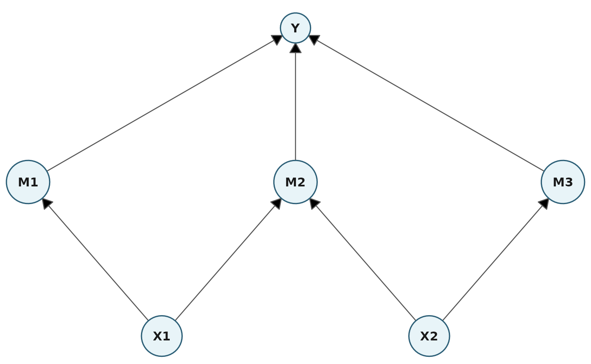

## Working with Different Graph Types

The plotting system works seamlessly with all supported graph types.

### Partially Directed Acyclic Graphs (PDAGs)

``` r
# Create a PDAG with both directed and undirected edges
pdag <- caugi(
  A %-->% B,
  B %---% C, # Undirected edge
  C %-->% D,
  class = "PDAG"
)

plot(
  pdag,
  edge_style = list(
    directed = list(col = "blue"),
    undirected = list(col = "gray", lwd = 2)
  )
)
```

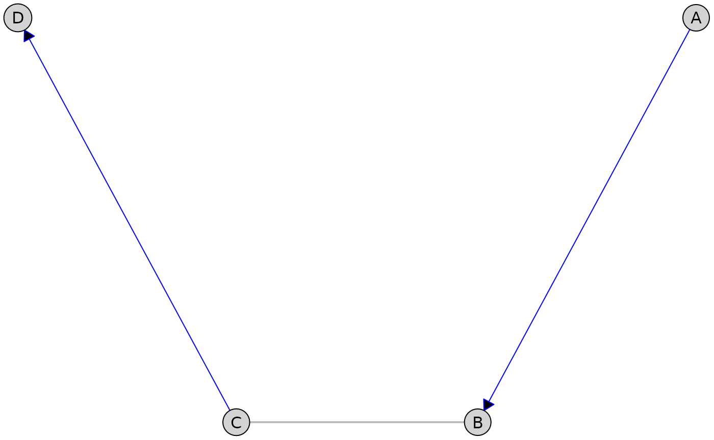

### Acyclic Directed Mixed Graphs (ADMGs)

``` r
# Create an ADMG with confounding
complex_admg <- caugi(
  X %-->% M1 + M2,
  M1 %-->% Y,
  M2 %-->% Y,
  M1 %<->% M2, # Latent confounder between mediators
  class = "ADMG"
)

plot(
  complex_admg,
  layout = "kamada-kawai",
  node_style = list(fill = "lavender"),
  edge_style = list(
    directed = list(col = "black", lwd = 1.5),
    bidirected = list(col = "red", lwd = 1.5, lty = "dashed", arrow_size = 3)
  )
)
```

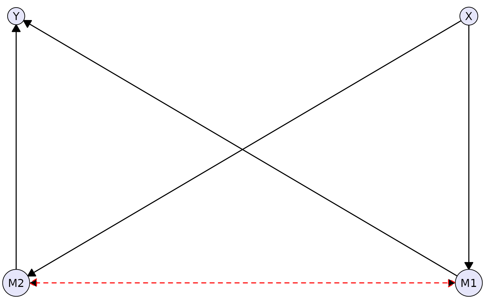

### Undirected Graphs (UGs)

``` r
# Create a Markov network
markov <- caugi(
  A %---% B + C,
  B %---% D,
  C %---% D + E,
  D %---% E,
  class = "UG"
)

plot(
  markov,
  layout = "fruchterman-reingold",
  node_style = list(
    fill = "lightyellow",
    col = "orange",
    lwd = 2
  ),
  edge_style = list(col = "orange")
)
```

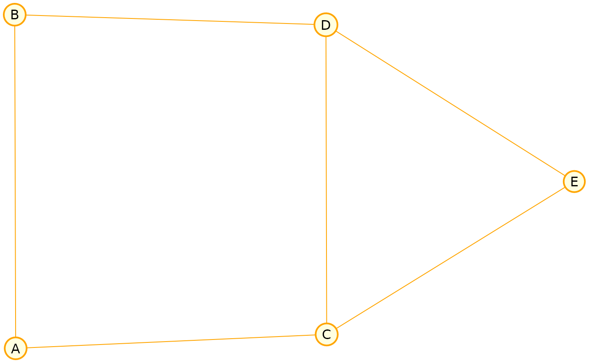

## Advanced Usage

### Manual Layouts

You can compute layouts separately and reuse them:

``` r
# Compute layout once
coords <- caugi_layout(dag, method = "sugiyama")

# The layout can be used for analysis or custom plotting
print(coords)
#>   name    x   y
#> 1   X1 0.25 0.0
#> 2   X2 0.75 0.0
#> 3   M1 0.00 0.5
#> 4   M2 0.50 0.5
#> 5   M3 1.00 0.5
#> 6    Y 0.50 1.0

# Plot uses the same layout, calling caugi_layout internally
plot(dag, layout = "sugiyama")
```


### Integration with Grid Graphics

`caugi` plots are built on grid graphics, and provide access to the
underlying grid `grob` object in the `@grob` slot of the plot output.
This allows for further customization using grid functions.

``` r
# Create a plot
p <- plot(cg)

# The grob slot is a grid graphics object
class(p@grob)
#> [1] "gTree" "grob"  "gDesc"

# You can manipulate it with grid functions
library(grid)

# Draw the plot rotated by 30 degrees
pushViewport(viewport(angle = 30))
grid.draw(p@grob)
popViewport()
```

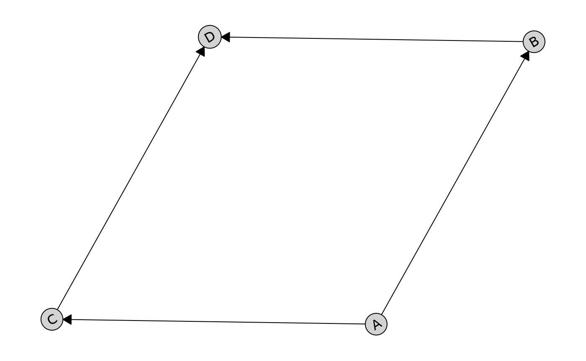

This also allows you to arrange multiple `caugi` plots using packages
like [gridExtra](https://cran.r-project.org/package=gridExtra).

## References

Fruchterman, Thomas M. J., and Edward M. Reingold. 1991. “Graph Drawing
by Force-Directed Placement.” *Software: Practice and Experience* 21
(11): 1129–64. <https://doi.org/10.1002/spe.4380211102>.

Kamada, Tomihisa, and Satoru Kawai. 1989. “An Algorithm for Drawing
General Undirected Graphs.” *Information Processing Letters* 31 (1):
7–15. <https://doi.org/10.1016/0020-0190(89)90102-6>.

Sugiyama, Kozo, Shojiro Tagawa, and Mitsuhiko Toda. 1981. “Methods for
Visual Understanding of Hierarchical System Structures.” *IEEE
Transactions on Systems, Man, and Cybernetics* 11 (2): 109–25.
<https://doi.org/10.1109/TSMC.1981.4308636>.
