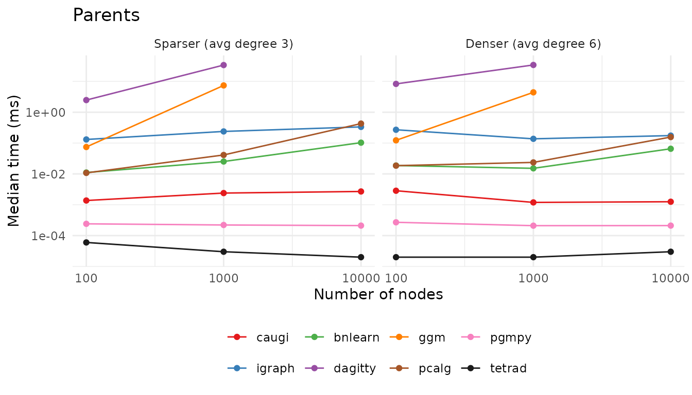
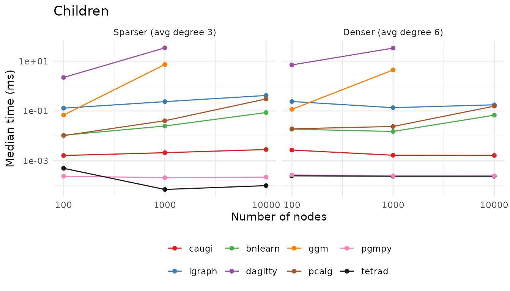
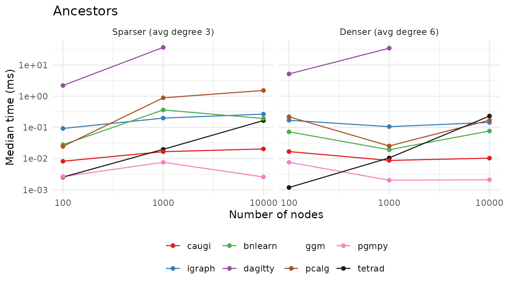
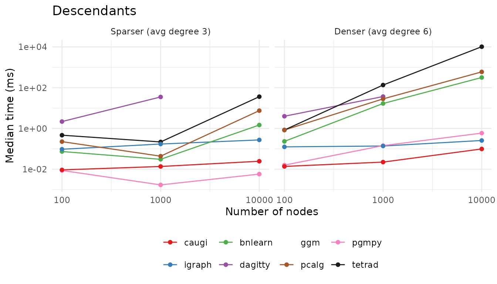
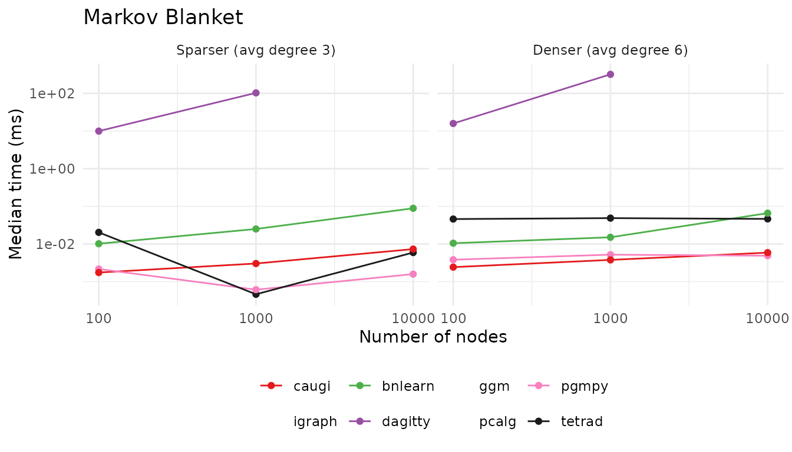
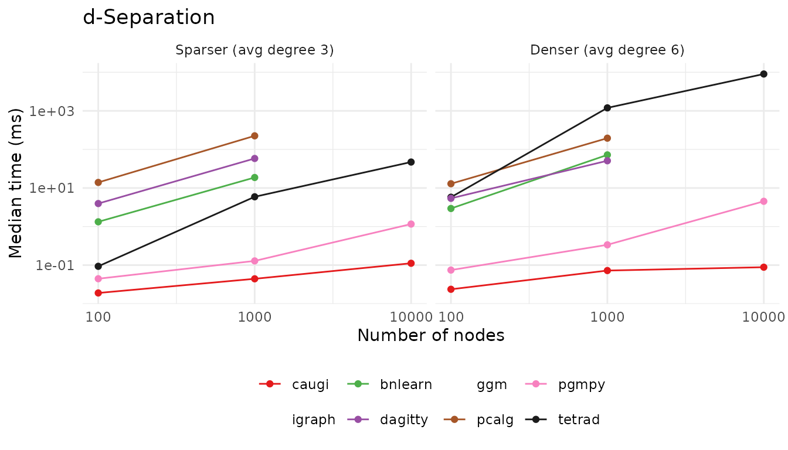
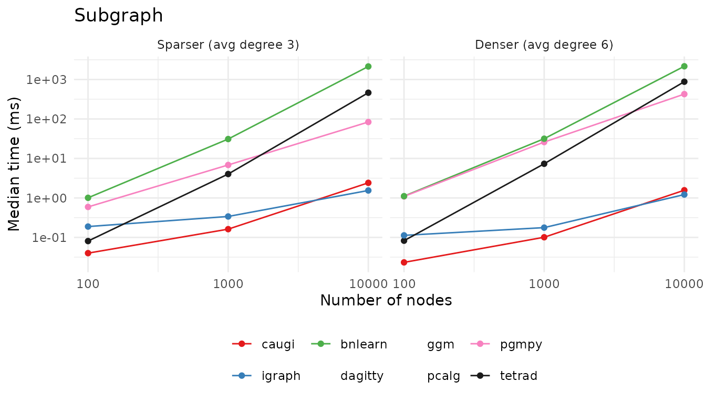

# Performance

This vignette compares the performance of `caugi` against R packages
([`igraph`](https://r.igraph.org/),
[`bnlearn`](https://www.bnlearn.com/),
[`dagitty`](https://dagitty.net/),
[`ggm`](https://cran.r-project.org/package=ggm),
[`pcalg`](https://pcalg.r-forge.r-project.org/)), the Python package
[`pgmpy`](https://pgmpy.org/), and the Java library
[Tetrad](https://www.cmu.edu/dietrich/philosophy/tetrad/). We focus on
the practical trade-offs that arise from different core data structures
and design choices.

The headline is: `caugi` frontloads computation. That is, `caugi` spends
more effort when constructing a graph and preparing indexes, so that
queries are wicked fast. The high performance is also due to the Rust
backend.

A note on Tetrad: it is included as a reference point—the de facto gold
standard implementation in causal discovery—but the comparison is not
strictly apples-to-apples, since Tetrad runs on the JVM (compiled Java)
while the R packages and `caugi` run with R-level dispatch overhead on
every call.

Benchmarks below are **precomputed**, with the last run on
2026-06-17T10:37:16+0200 on host terra (Linux).

Versions:

- caugi 1.2.0.9000
- igraph 2.2.2
- bnlearn 5.1
- dagitty 0.3.4
- ggm 2.5.2
- pcalg 2.7.12
- pgmpy 1.1.2
- Tetrad 7.6.10.

## Design Choices

### Compressed Sparse Row (CSR) Representation

The core data structure in `caugi` is a compressed sparse row (CSR)
representation of the graph. CSR representations store, for each vertex,
a contiguous slice of neighbor IDs with a pointer (offset) array that
marks the start and end of each slice. This format is memory-efficient
for sparse graphs. The `caugi` graph object also stores important query
information directly, allowing parent, child, and neighbor queries to be
done in $`\mathcal{O}(1)`$ time. This yields a larger memory footprint,
but the trade-off is that queries are extremely fast.

### Mutation and Lazy Building

The `caugi` graph objects are expensive to build. This is the
performance downside of using `caugi`. Each time we make a modification
to a `caugi` graph object, we need to rebuild the graph completely since
the graph object is immutable by design. This has complexity
$`\mathcal{O}(|V| + |E|)`$, where $`V`$ is the vertex set and $`E`$ is
the edge set.

However, the graph object will only be rebuilt when the user either
calls [`build()`](https://caugi.org/dev/reference/build.md) directly or
queries the graph. Therefore, you do not need to worry about wasting
compute time by iteratively making changes to a `caugi` graph object, as
the graph rebuilds lazily when queried. By doing this, `caugi` graphs
*feel* mutable, but, in reality, they are not.

By doing it this way, we ensure

- that the graph object is always in a consistent state when queried and
- that queries are as fast as possible,

while keeping the user experience smooth.

## Comparison

The comparison covers seven operations across a parameter grid of graph
sizes $`n`$ and edge densities. All packages run on the same generated
DAG fixtures so query results are directly comparable.

The grid covers $`n \in \{100, 1\,000, 10\,000\}`$ at two density
levels, parametrized by the **average in-degree** $`d`$ (equivalently
the average out-degree, or total edges divided by number of nodes). We
sample DAGs with per-edge probability $`p = 2d / (n - 1)`$, which makes
the expected in-degree exactly $`d`$ regardless of $`n`$. The grid uses
$`d = 3`$ for the sparser cells and $`d = 6`$ for the denser ones, so a
node has on average $`\approx 3`$ (or $`\approx 6`$) parents and
$`\approx 3`$ (or $`\approx 6`$) children, with edge counts that grow
linearly with $`n`$. The slowest packages (`dagitty`, `ggm`, plus
[`bnlearn::dsep`](https://rdrr.io/pkg/bnlearn/man/dsep.html) and
`pcalg::dsep`) are skipped at $`n = 10\,000`$ via the `skip` table in
`spec.json`; the affected lines simply end at $`n = 1\,000`$.

### Relational Queries

Direct neighbor lookups (`parents`, `children`) are $`O(1)`$ for
`caugi`, `igraph`, `bnlearn`, and Tetrad—they all maintain adjacency
tables. `pgmpy` is a thin wrapper over NetworkX’s predecessor/successor
lookups. `pcalg` and `ggm` scan a row or column of the adjacency matrix
on each call ($`O(n)`$), with `ggm` paying noticeably more R-level
overhead. `dagitty` is the outlier: it re-derives neighbors from its
string DSL representation each call and pays a linear-in-edges cost.

``` r

bench_parents <- function(graphs, fx) {
  v <- fx$test_node
  v_idx <- match(v, graphs$nodes)

  calls <- list(
    caugi = bquote(caugi::parents(graphs$cg, .(v))),
    igraph = bquote(igraph::neighbors(graphs$ig, .(v), mode = "in")),
    bnlearn = bquote(bnlearn::parents(graphs$bn, .(v))),
    dagitty = bquote(dagitty::parents(graphs$dg, .(v))),
    ggm = bquote(ggm::pa(.(v), graphs$am)),
    pcalg = bquote(pcalg::searchAM(graphs$amat_pag, .(v_idx), type = "pa"))
  )

  run_bench(calls, "parents", fx)
}
```



``` r

bench_children <- function(graphs, fx) {
  v <- fx$test_node
  v_idx <- match(v, graphs$nodes)

  calls <- list(
    caugi = bquote(caugi::children(graphs$cg, .(v))),
    igraph = bquote(igraph::neighbors(graphs$ig, .(v), mode = "out")),
    bnlearn = bquote(bnlearn::children(graphs$bn, .(v))),
    dagitty = bquote(dagitty::children(graphs$dg, .(v))),
    ggm = bquote(ggm::ch(.(v), graphs$am)),
    pcalg = bquote(pcalg::searchAM(graphs$amat_pag, .(v_idx), type = "ch"))
  )

  run_bench(calls, "children", fx)
}
```



As you can see from the plots, Tetrad is fastest (sub-microsecond), with
`pgmpy` and `caugi` close behind; all three stay flat as $`n`$ grows, as
do `igraph` and `bnlearn`. The cost of `pcalg`’s $`O(n)`$ row scan,
hidden at small $`n`$, becomes visible by $`n = 10000`$, where it climbs
to a few tenths of a millisecond. `ggm` and `dagitty` pay the most for
re-deriving neighbors on every call: by $`n = 1000`$ they are already
one to two orders of magnitude slower than the rest, and both are
skipped at $`n = 10000`$ (their lines simply stop). For the
front-runners the absolute times are tiny and the gaps between them
mostly reflect dispatch overhead differences between Python, R, and Java
rather than anything that matters in practice.

### Ancestors and Descendants

These require transitive closure (BFS/DFS over the directed graph). Here
`caugi`’s CSR pays off—both forward and reverse adjacency are
precomputed, so traversal is tight pointer-chasing in Rust.

``` r

bench_ancestors <- function(graphs, fx) {
  v <- fx$test_node
  v_idx <- match(v, graphs$nodes)

  calls <- list(
    caugi = bquote(caugi::ancestors(graphs$cg, .(v))),
    igraph = bquote(igraph::subcomponent(graphs$ig, .(v), mode = "in")),
    bnlearn = bquote(bnlearn::ancestors(graphs$bn, .(v))),
    dagitty = bquote(dagitty::ancestors(graphs$dg, .(v))),
    pcalg = bquote(pcalg::searchAM(graphs$amat_pag, .(v_idx), type = "an"))
  )

  run_bench(calls, "ancestors", fx)
}
```



``` r

bench_descendants <- function(graphs, fx) {
  v <- fx$test_node
  v_idx <- match(v, graphs$nodes)

  calls <- list(
    caugi = bquote(caugi::descendants(graphs$cg, .(v))),
    igraph = bquote(igraph::subcomponent(graphs$ig, .(v), mode = "out")),
    bnlearn = bquote(bnlearn::descendants(graphs$bn, .(v))),
    dagitty = bquote(dagitty::descendants(graphs$dg, .(v))),
    pcalg = bquote(pcalg::searchAM(graphs$amat_pag, .(v_idx), type = "de"))
  )

  run_bench(calls, "descendants", fx)
}
```



`caugi` is the most consistent here: sub-millisecond on every fixture
for both ancestors and descendants, and barely moving as $`n`$ grows.
[`igraph::subcomponent()`](https://r.igraph.org/reference/subcomponent.html)
and `pgmpy`’s NetworkX-backed traversal also stay fast across the grid.
Descendants on the dense $`n = 10000`$ fixture is where the design
differences blow up: Tetrad takes about ten *seconds*, while `pcalg` and
`bnlearn` reach several hundred milliseconds—`caugi` finishes the same
query in roughly a tenth of a millisecond, a five-orders-of-magnitude
gap to Tetrad. `dagitty` is again one to two orders of magnitude slower
than the front-runners on the sizes it can handle, paying its
DSL-reparsing cost on every call, and is skipped at $`n = 10000`$.

### Markov Blanket

The Markov blanket of a node $`v`$ is
`parents(v) ∪ children(v) ∪ parents(children(v))`. `caugi`, `bnlearn`,
and Tetrad have direct accessors backed by adjacency tables; `dagitty`
re-derives it from its DSL representation each call; `pgmpy` walks
NetworkX edges. `pcalg` and `ggm` do not expose a Markov-blanket helper
and are omitted.

``` r

bench_markov_blanket <- function(graphs, fx) {
  v <- fx$test_node

  calls <- list(
    caugi = bquote(caugi::markov_blanket(graphs$cg, .(v))),
    bnlearn = bquote(bnlearn::mb(graphs$bn, .(v))),
    dagitty = bquote(dagitty::markovBlanket(graphs$dg, .(v)))
  )

  run_bench(calls, "markov_blanket", fx)
}
```



`caugi`, `pgmpy`, and `bnlearn` all resolve Markov blankets in
microseconds across the entire grid, and Tetrad stays well under a
millisecond too. `dagitty` is the outlier, climbing into the hundreds of
milliseconds on the dense $`n = 1000`$ fixture because it re-derives the
blanket from its DSL representation on every call; it is skipped at
$`n = 10000`$.

### D-Separation

For each fixture we pick a random `(X, Y)` pair and compute a **minimal
d-separator** `Z` with
[`caugi::minimal_separator()`](https://caugi.org/dev/reference/minimal_separator.md)—that
is, a smallest set of nodes whose conditioning blocks every path between
`X` and `Y` in the DAG. The same triple `(X, Y, Z)` is then passed to
every package’s d-separation routine, so every package answers “is
`X ⫫ Y | Z`?” on identical inputs. Tetrad uses the m-separation
generalisation (equivalent on DAGs). `pcalg::dsep()` follows Lauritzen’s
moralization-based test on a `graphNEL`.

``` r

bench_dsep <- function(graphs, fx) {
  if (is.null(fx$dsep)) {
    return(NULL)
  }

  x <- fx$dsep$x
  y <- fx$dsep$y
  z <- unlist(fx$dsep$z)

  calls <- list(
    caugi = bquote(caugi::d_separated(graphs$cg, .(x), .(y), .(z))),
    bnlearn = bquote(bnlearn::dsep(graphs$bn, .(x), .(y), .(z))),
    dagitty = bquote(dagitty::dseparated(graphs$dg, .(x), .(y), .(z))),
    pcalg = bquote(pcalg::dsep(.(x), .(y), .(z), graphs$gNEL))
  )

  run_bench(calls, "d_separated", fx)
}
```



`caugi` is the clear winner here, staying near a tenth of a millisecond
on every fixture, including the dense $`n = 10000`$ graph. `pgmpy` is
the runner-up, within a few milliseconds throughout. This is the one
operation where Tetrad’s compiled code does *not* save it: its
m-separation routine explores paths in a way that scales badly on dense
graphs, reaching over a second at $`n = 1000`$ and roughly nine seconds
at $`n = 10000`$—a striking example of an algorithmic choice dominating
the language advantage. Among the R packages, `bnlearn` and `pcalg` pay
to build a moralized graph on each call (`pcalg` into the hundreds of
milliseconds at $`n = 1000`$, slowest of the three R competitors), and
`dagitty` re-parses its DSL; all three are skipped at $`n = 10000`$.

### Subgraph Extraction

Subgraph extraction is where we explicitly test graph **building**
performance. For `caugi` we time `subgraph(cg, nodes) |> build()`
together so the CSR rebuild cost is captured. `igraph`, `bnlearn`,
`pgmpy`, and Tetrad all return adjacency-backed subgraphs without an
analogous index rebuild step. `pcalg` exposes no native subgraph
constructor (users typically call
[`graph::subGraph()`](https://rdrr.io/pkg/graph/man/subGraph.html) on
the underlying `graphNEL`), so it is omitted here.

``` r

bench_subgraph <- function(graphs, fx) {
  sub <- unlist(fx$subgraph_nodes)

  calls <- list(
    caugi = bquote({
      sg <- caugi::subgraph(graphs$cg, .(sub))
      caugi::build(sg)
    }),
    igraph = bquote(igraph::subgraph(graphs$ig, .(sub))),
    bnlearn = bquote(bnlearn::subgraph(graphs$bn, .(sub)))
  )

  run_bench(calls, "subgraph", fx)
}
```



`caugi` and `igraph` are the only packages that stay in the
low-single-digit milliseconds at $`n = 10000`$ (around 1-2 ms). The two
run neck-and-neck: `caugi` is ahead at $`n = 100`$ and $`n = 1000`$,
while `igraph` edges it out on the largest fixture—remarkably close
given that `caugi` pays for a full CSR rebuild on every call. Everyone
else is one to three orders of magnitude slower on the largest fixtures,
copying nodes and edges into a fresh object each call: `pgmpy` reaches
tens to hundreds of milliseconds, Tetrad several hundred, and `bnlearn`
over two seconds. The takeaway is that even though `caugi` graphs are
nominally expensive to construct, the rebuild after
[`subgraph()`](https://caugi.org/dev/reference/subgraph.md) is fast
enough to beat adjacency-list constructors that rebuild no indexes at
all.

## Summary

Across the seven operations, `caugi` either leads or sits in the leading
group:

- It matches or beats `igraph` and `bnlearn` on the $`O(1)`$ adjacency
  lookups (`parents`, `children`, Markov blanket).
- It is the fastest R package by a wide margin on transitive-closure
  operations (`ancestors`, `descendants`, d-separation), where the CSR’s
  precomputed forward and reverse adjacency pays off.
- Even on [`subgraph()`](https://caugi.org/dev/reference/subgraph.md),
  where the CSR has to be rebuilt, it stays in the low-single-digit
  milliseconds at $`n = 10000`$ (matched only by `igraph`), while
  `bnlearn`, `pgmpy`, and Tetrad reach hundreds of milliseconds to
  seconds.

The most striking pattern emerges at $`n = 10000`$: `caugi` is the only
package that stays fast across *every* operation. Tetrad (compiled Java)
and `pgmpy` (NetworkX-backed) beat `caugi` on the simplest lookups by a
small constant factor, which is unsurprising given the R-level dispatch
overhead `caugi` pays on every call. But several competitors either run
out of room (`dagitty`, `ggm`, and the moralization-based d-separation
tests are too slow to include at $`n = 10000`$) or collapse on specific
operations. Tetrad in particular, despite being compiled, takes seconds
on dense descendants and d-separation queries because of how those
routines scale, not because of the language.

The headline holds: by frontloading work into the build step and
querying a CSR-backed structure, `caugi` keeps query times effectively
constant in graph size for the operations users hit most often. The
price is paid up front, in the rebuild step that runs lazily on the
first query after a mutation.

## Reproducing These Benchmarks

The R benchmark code shown in the chunks above is the actual source:
each chunk has `eval = FALSE` so the rendered vignette does not run
them, and the wrapper script at
[`tools/benchmark/run_r_bench.R`](https://github.com/frederikfabriciusbjerre/caugi/tree/main/tools/benchmark/run_r_bench.R)
extracts them with
[`knitr::purl()`](https://rdrr.io/pkg/knitr/man/knit.html) and sources
the result into the R session.

The full harness lives in
[`tools/benchmark/`](https://github.com/frederikfabriciusbjerre/caugi/tree/main/tools/benchmark)
and uses [Task](https://taskfile.dev) to orchestrate the cross-language
runners. To reproduce just the R numbers (no Python or Java toolchains
needed):

``` sh
cd tools/benchmark
task fixtures && task r
```

`task r` purls the vignette into `tools/benchmark/bench_r.R`, runs it,
prints a per-package, per-operation summary, and writes the raw timings
to `results/r.csv`. Do not edit `bench_r.R` directly—change the chunks
in this vignette instead. See `tools/benchmark/README.md` for the full
pipeline (`task all`) and per-language details.

## Session Info

    #> R version 4.6.1 (2026-06-24)
    #> Platform: x86_64-pc-linux-gnu
    #> Running under: Ubuntu 24.04.4 LTS
    #> 
    #> Matrix products: default
    #> BLAS:   /usr/lib/x86_64-linux-gnu/openblas-pthread/libblas.so.3 
    #> LAPACK: /usr/lib/x86_64-linux-gnu/openblas-pthread/libopenblasp-r0.3.26.so;  LAPACK version 3.12.0
    #> 
    #> locale:
    #>  [1] LC_CTYPE=C.UTF-8       LC_NUMERIC=C           LC_TIME=C.UTF-8       
    #>  [4] LC_COLLATE=C.UTF-8     LC_MONETARY=C.UTF-8    LC_MESSAGES=C.UTF-8   
    #>  [7] LC_PAPER=C.UTF-8       LC_NAME=C              LC_ADDRESS=C          
    #> [10] LC_TELEPHONE=C         LC_MEASUREMENT=C.UTF-8 LC_IDENTIFICATION=C   
    #> 
    #> time zone: UTC
    #> tzcode source: system (glibc)
    #> 
    #> attached base packages:
    #> [1] stats     graphics  grDevices utils     datasets  methods   base     
    #> 
    #> other attached packages:
    #> [1] ggplot2_4.0.3
    #> 
    #> loaded via a namespace (and not attached):
    #>  [1] vctrs_0.7.3        cli_3.6.6          knitr_1.51         rlang_1.2.0       
    #>  [5] xfun_0.59          otel_0.2.0         generics_0.1.4     S7_0.2.2          
    #>  [9] textshaping_1.0.5  jsonlite_2.0.0     glue_1.8.1         htmltools_0.5.9   
    #> [13] ragg_1.5.2         sass_0.4.10        scales_1.4.0       rmarkdown_2.31    
    #> [17] grid_4.6.1         tibble_3.3.1       evaluate_1.0.5     jquerylib_0.1.4   
    #> [21] fastmap_1.2.0      yaml_2.3.12        lifecycle_1.0.5    compiler_4.6.1    
    #> [25] dplyr_1.2.1        RColorBrewer_1.1-3 fs_2.1.0           pkgconfig_2.0.3   
    #> [29] htmlwidgets_1.6.4  farver_2.1.2       systemfonts_1.3.2  digest_0.6.39     
    #> [33] R6_2.6.1           tidyselect_1.2.1   pillar_1.11.1      magrittr_2.0.5    
    #> [37] bslib_0.11.0       withr_3.0.3        tools_4.6.1        gtable_0.3.6      
    #> [41] pkgdown_2.2.0      cachem_1.1.0       desc_1.4.3
